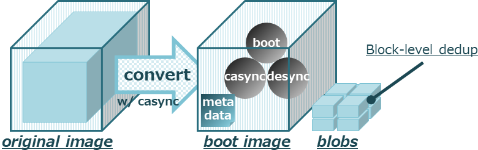
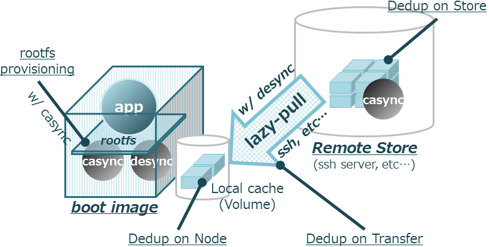
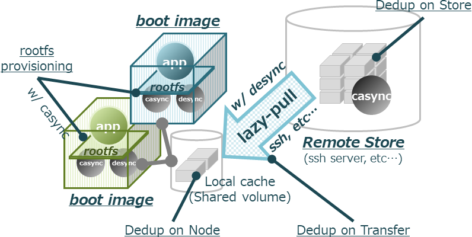

# Container Bootfs ([casync](https://github.com/systemd/casync) and [desync](https://github.com/folbricht/desync) inside.)

## About bootfs
__Container Bootfs__(__bootfs__ below.) aims to achieve block-level image chunking, de-duplication and lazy-pull execution without any modifications on container runtimes or registries and without any dedicated NFS infrastructure.
The status of this project is __Rough PoC__, and bootfs is incomplete as mentioned later.
Currently, we leverage [casync](https://github.com/systemd/casync) and [desync](https://github.com/folbricht/desync) for provisioning rootfs and lazy-pulling image data.

## Context
Now, next generation of OCI image spec is under active discussion!
- https://groups.google.com/a/opencontainers.org/forum/#!topic/dev/icXssT3zQxE
- https://github.com/openSUSE/umoci/issues/256

Roughly speaking, some of points which has been frequently discussed about current OCI images are following.
- Storage inefficiency of layer-level de-duplication.
- Slow container startup time caused by lack of lazy-pull functionality.
- Lack of seek functionality on tar archive format.

So far, several effective concepts has been proposed.(alphabetical order)
- CernVM-FS Graph Driver Plugin for Docker : [http://iopscience.iop.org/article/10.1088/1742-6596/1085/3/032019](http://iopscience.iop.org/article/10.1088/1742-6596/1085/3/032019)
- FILEgrain : [https://github.com/AkihiroSuda/filegrain](https://github.com/AkihiroSuda/filegrain)
- Slacker : [https://www.usenix.org/node/194431](https://www.usenix.org/node/194431)
- atomfs and stacker : [https://fosdem.org/2019/schedule/event/containers_atomfs/](https://fosdem.org/2019/schedule/event/containers_atomfs/)

If there are projects should be added, please let me know.

## Architecture

We aimed to achieve container image's *block-level de-duplication on store*, *on transfer* and *on the execution node* and the *lazy-pull* execution *without any modification on container runtime or registry*, as following.

### Converting images.
You can generate new images which can be stored in de-dup manners and can be run with lazy-pull, based on an existing one.
We developed the image converter which generates following data.
- __Boot image__: Generated Docker image. This image include __boot__ program which has responsibility to set up the execution environment on boot, using casync and desync (both of them are also included in the image), then exec the original ENTRYPOINT app in the container. We use casync for provisioning the original image's rootfs with FUSE based on included metadata (aka [caibx or caidx](https://github.com/systemd/casync#file-suffixes)). By desync process, most of the original rootfs data will be *pulled lazily* from __remote chunk store__ on access, and cached locally. We use desync's [cache functionality](https://github.com/folbricht/desync#caching), so if some blobs are on the node, desync just use these blobs without pulling them remotely, which leads to *block-level de-duplication on transfer*. If you use container's volume as __local cache__, this can be shared with several containers on the node, then you can achieve *block-level inter-container de-duplication on the node*. This boot image follows [Docker image spec](https://github.com/moby/moby/blob/master/image/spec/v1.2.md), so you can pull and run it from container registry in very normal ways *without modification on the container runtime or registry*.
- __Rootfs blobs__ : The original image's block-level CDC-chunked rootfs blobs. We use casync for chunking. Put this blobs on somewhere like a cluster-global storage (we call it __remote chunk store__). If you store some sets of blobs generated by some containers in a same store, you can achieve *block-level de-duplication on the store*.



### Running images.
At runtime, the boot program sets up the execution environment, casync provisions the original rootfs using FUSE and desync pulls the rootfs blobs lazily from remote chunk store, as mentioned above.
The remote chunk store can be anything desync supports.
As we will mention in TODO list later, by extending desync to be able to talk container registry API, we believe that we can combine the boot image and the blobs into one OCI compatible image using similar way of FILEgrain project doing and that we can pull it in a manner of container runtimes doing, which means we don't need to have dedicated remote chunk stores anymore.
In our example, we use a SSH server with casync installed.
See [the sample SSH server container's Dockerfile in this repo](sample/ssh/Dockerfile) which is quite simple.
```Dockerfile
FROM rastasheep/ubuntu-sshd:latest
RUN apt update -y && apt install -y casync
CMD ["/usr/sbin/sshd", "-D"]
```



### Sharing cache.
When you use a volume as local cache, you can share it among containers on the node.
The volume needs to be mounted on a specific path (`/.bootfs/rootfs.castr`).
It is useful to keep the volume using [a simple volume-keeper container](sample/cache/Dockerfile) like below, and share it among containers.
```Dockerfile
FROM busybox:latest
RUN mkdir -p /.bootfs/rootfs.castr
VOLUME /.bootfs/rootfs.castr
CMD tail -f /dev/null
```



## TODO
Currently, the status of bootfs is __Rough PoC__.
So currently, this is not perfect.
Some of the TODOs are listed below.

- [ ] We need to evaluate bootfs in quantitative ways (__critical !!!__).
- [ ] We use move mount and casync's FUSE mount functionality to provision rootfs. So we need to use insecure runtime options `--privileged` and `--device /dev/fuse`. We can find a same kind of issue related to FUSE on the [Docker repo](https://github.com/docker/for-linux/issues/321).
- [ ] We cannot pull blobs from a container registry, which means we cannot combine boot image and the blobs into one container image and put it on a container registry. This is because we rely on desync for pulling blobs, which doesn't talk registry API. First we need to extend desync to support registry API, and then combine boot image and blobs using the way like [FILEgrain project](https://github.com/AkihiroSuda/filegrain) proposing. By doing it, we don't need dedicated remote chunk stores anymore.
- [ ] We cannot use container's volume functionality if we don't make mountpoint placeholder (dummy files or directories) on the original rootfs in advance, because the provisioned rootfs is read-only and we cannot make the placeholder at runtime.
- [ ] SSH client implementation is very ad-hoc. Let's say, desync rely on the system's ssh client and we are using [Dropbear](http://matt.ucc.asn.au/dropbear/dropbear.html) which may be fine. But, we inheriting original rootfs's user information configured in `/etc` (which is including `/etc/passwd` file, etc) without creating the bootfs-specific one. We also need to consider about around authentication, but currently we don't use any certifications and also ignore the dropbare's known_hosts checking.
- [ ] Boot image is heavy. But, this would be shared among all containers on node, thanks to container runtime's native layer-level de-duplication functionality. Maybe We need to create lighter binary which includes functionalities of boot program's setting-up functionality, casync's rootfs-provisioning functionality and desync's lazy-pull functionality.
- [ ] We make blobs only from the original view of *rootfs*, not from *layers*. This means we through away the layer information of the original image.
- [ ] We can see casync and desync processes from any app, thus can break the world by reaping them. We need to `unshare(2)` PID namespace between setup-related processes and the others.
- [ ] Currently, we haven't gotten any trouble by move mounting from new rootfs to `/`, which could affect to casync and desync processes which rely on directories or files in original rootfs (like pulled blobs). But, move mounting possibly could affect them in dangerous ways. Maybe we need to `unshare(2)` mount namespaces between setup-related processes and the other.

## Play with sample.

### Preparation.
We use [cache container's](sample/cache/Dockerfile) volume as local cache on the node, and a [SSH server container](sample/ssh/Dockerfile) named `${SSH_SERVER_NAME}` as remote chunk store which use a volume `${SSH_SERVER_STORE}`.
We use `${CONVERTER_OUTPUT_DIR}` directory to gain the converted image by the image converter.
```shell
LOCAL_CACHE_NAME=node-local-cache
LOCAL_CACHE_STORE=/tmp/node-local-cache
SSH_SERVER_NAME=ssh-casync-server
SSH_SERVER_STORE=/tmp/ssh-casync-server-store
CONVERTER_OUTPUT_DIR=/tmp/converter-output
mkdir ${LOCAL_CACHE_STORE} ${SSH_SERVER_STORE} ${CONVERTER_OUTPUT_DIR}
```
Build remote chunk store container at `/sample/ssh` and run it.
```shell
sudo docker build -t ${SSH_SERVER_NAME}:v1 .
sudo docker run --rm -d --network="bridge" \
                --name ${SSH_SERVER_NAME} \
                -v ${SSH_SERVER_STORE}:/store \
                ${SSH_SERVER_NAME}:v1
SSH_SERVER_IP=$(sudo docker inspect ${SSH_SERVER_NAME} --format '{{.NetworkSettings.IPAddress}}')
```
Then build the local cache container at `/sample/cache` and run it.
```shell
sudo docker build -t ${LOCAL_CACHE_NAME}:v1 .
sudo docker run --rm -d \
                --name ${LOCAL_CACHE_NAME} \
                -v ${LOCAL_CACHE_STORE}:/.bootfs/rootfs.castr \
                ${LOCAL_CACHE_NAME}:v1
```

### Build the image converter.
Build the image converter as container at `/` of this repo.
```shell
sudo docker build -t mkimage:latest .
```

### Convert images.
```shell
sudo docker run -i -v /var/run/docker.sock:/var/run/docker.sock \
                -v ${CONVERTER_OUTPUT_DIR}:/output \
                mkimage:latest ubuntu:latest ubuntu-converted:latest
```
Then, store the blobs into remote chunk store container's volume.
```shell
sudo mv ${CONVERTER_OUTPUT_DIR}/rootfs.castr/* ${SSH_SERVER_STORE}/
```

### Run it.
```shell
sudo docker run -it --privileged --device /dev/fuse \
                --volumes-from ${LOCAL_CACHE_NAME} \
                -e BLOB_STORE=ssh://root@${SSH_SERVER_IP}/store \
                -e DROPBEAR_PASSWORD=root \
                ubuntu-converted:latest
```
You can share the local cache among containers by specifying `--volumes-from ${LOCAL_CACHE_NAME}` runtime option.

### Measure it.
We can see how many block-level blobs are actually pulled lazily.
On boot, the number of cached blobs would be like below.
```shell
find ${LOCAL_CACHE_STORE} -name *.cacnk | wc -l
96
find ${SSH_SERVER_STORE} -name *.cacnk | wc -l
951
```
The number of blobs in `${LOCAL_CACHE_STORE}` will increase on access to the rootfs.
After executing `top` command inside the container, the number of cached blobs would increase like below.
```shell
find ${LOCAL_CACHE_STORE} -name *.cacnk | wc -l
139
find ${SSH_SERVER_STORE} -name *.cacnk | wc -l
951
```
